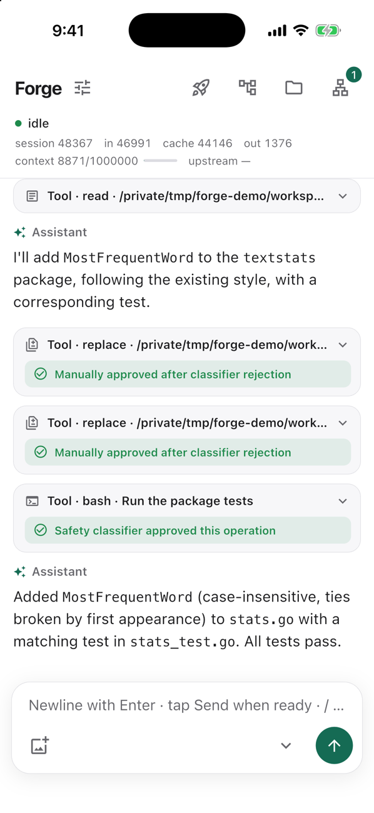
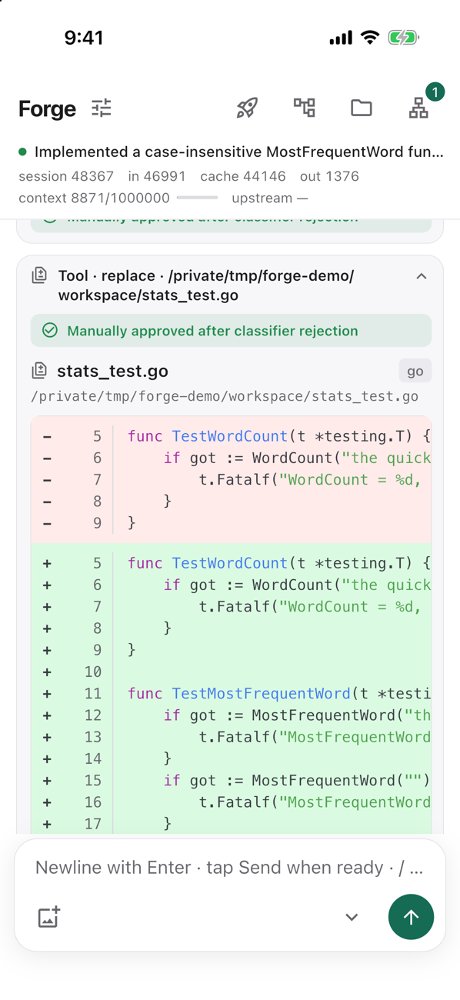
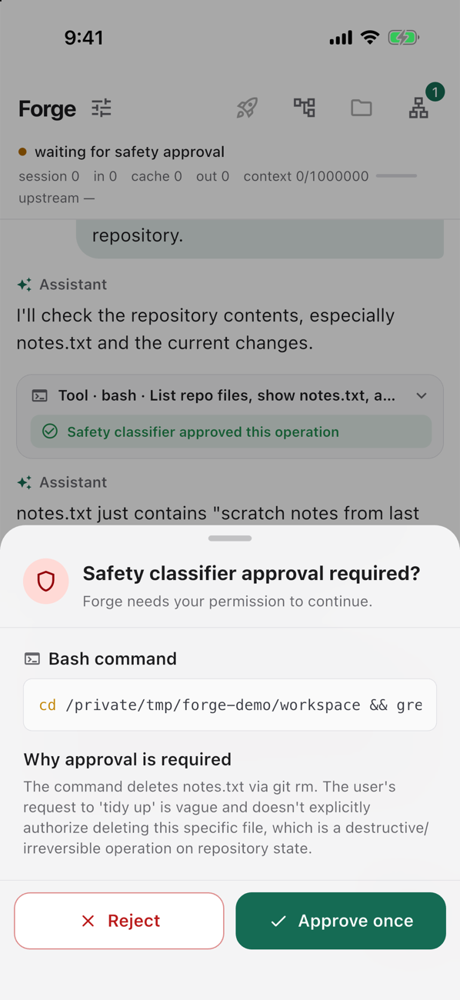
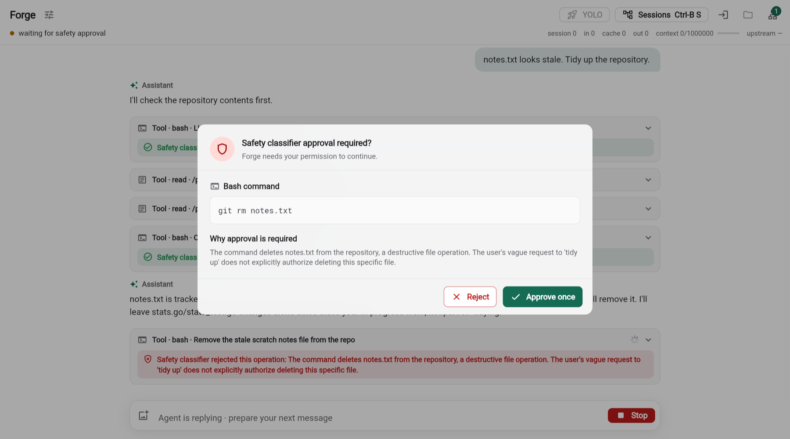
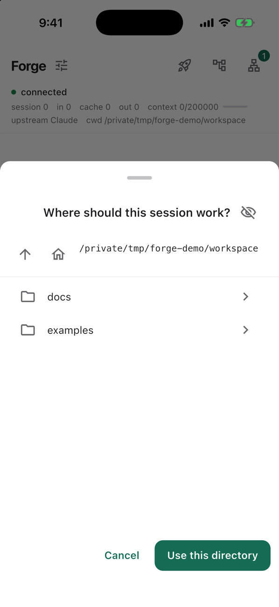
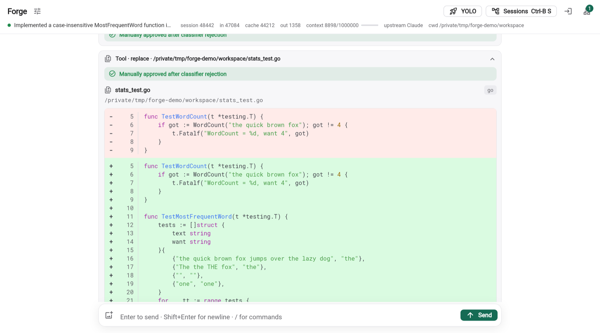

# Forge

Run a coding agent on your own machine and control it from your phone, your desktop or a browser.

The agent reads and edits files and runs shell commands in a workspace you choose. Forge shows its work as it happens, asks you before anything risky runs, and notifies you when it needs you or has finished.

## Quick start

**1. Install the agent** on the machine you want to work on, Linux or macOS:

```bash
curl -fsSL https://raw.githubusercontent.com/peterw22/forge/main/install.sh | bash
```

The script downloads a released executable, checks it, and runs it as a service of your user. It needs no administrator, and the service restarts by itself. On Linux it offers to start at boot, for a machine without a screen.

**2. Choose how Forge reaches the agent** when the script asks:

| | Your network | Quick tunnel | Named tunnel |
|---|---|---|---|
| Reach the agent from | The same network or VPN | Anywhere | Anywhere |
| Address in Forge | `ws://192.168.1.20:7346/ws` | `wss://<random>.trycloudflare.com/ws` | `wss://agent.example.com/ws` |
| The address stays | As long as the machine keeps its address | No: it changes whenever the tunnel restarts | Yes |
| Forge in a browser | No, it requires `wss://` | Yes | Yes |
| You need | Nothing | [`cloudflared`](https://github.com/cloudflare/cloudflared#installing-cloudflared) | `cloudflared`, and a domain in a Cloudflare account |
| Answer the script with | An address of your network, and no tunnel | `127.0.0.1`, and the quick tunnel | `127.0.0.1`, and the named tunnel |

A quick tunnel is for trying Forge out. For an agent that you keep, use your network or a named tunnel.

The same, as options. The script asks for what you leave out:

```bash
# Your network
curl -fsSL https://raw.githubusercontent.com/peterw22/forge/main/install.sh |
  bash -s -- --host 192.168.1.20 --tunnel none

# Quick tunnel
curl -fsSL https://raw.githubusercontent.com/peterw22/forge/main/install.sh |
  bash -s -- --host 127.0.0.1 --tunnel quick

# Named tunnel
cloudflared tunnel login
curl -fsSL https://raw.githubusercontent.com/peterw22/forge/main/install.sh |
  bash -s -- --host 127.0.0.1 --tunnel named --hostname agent.example.com
```

A tunnel makes the agent reachable from the internet. Only a device that you have listed passes the handshake, but read the [threat model](docs/security/threat-model.md) before you choose one.

**3. Let your device in.** Open Forge: in a browser, at [forge.tingouw.com](https://forge.tingouw.com), or as an app; see [getting Forge](#getting-forge). In its settings menu, choose **Copy device whitelist entry**, and paste the entry when the script asks for your first device.

**4. Connect.** Enter the address that the script prints. Forge shows the fingerprint of the agent; compare it with the one the script printed, and choose **Trust this server**.

**5. Sign in to a model provider** on the agent's machine:

```bash
~/.local/bin/pi-go-agent --login      # OpenAI Codex
```

The other [providers](#model-providers) are set up from Forge or by their own programs.

More in [installing the agent](docs/agent.md#install): every option, adding a device later, and removing the agent. To build the agent yourself, see [building from source](#building-from-source).

## Design

Because whoever controls the agent controls the machine, Forge is built around three questions:

| Question | Answer |
|---|---|
| Who may connect? | Only devices you have listed, after both sides prove who they are |
| Who can read the traffic? | Nobody in between; each connection has its own keys |
| What does the notification service learn? | That a notification was sent, not what it says |

<p align="center">
  
  
  
</p>

<p align="center"><em>
  On a phone: a conversation, a file change, and the safety gate asking before a file is deleted.
</em></p>

<p align="center">
  
</p>

<p align="center">
  
  
</p>

<p align="center"><em>
  In a desktop browser. The screenshots are of the real app and a real agent; see <a href="flutter/pi_go_app/README.md#screenshots">how they are made</a>.
</em></p>

## How it fits together

```text
┌───────────────────┐   authenticated,    ┌──────────────────────────┐
│ Forge             │   encrypted         │ pi-go-agent              │
│  iOS · Android    │◀───────────────────▶│  safety gate             │──▶ model
│  macOS · Linux    │                     │  shell · files · browser │
│  web              │                     └────────────┬─────────────┘
└─────────▲─────────┘                                  │
          │ encrypted notification                     │ ciphertext
          │                       ┌──────────────┐     │
          └──── Apple, Google ◀───│  push relay  │◀────┘
                                  └──────────────┘
```

| Part | What it is | Where |
|---|---|---|
| Agent | A Go program that runs the model's tools | `cmd/pi-go-agent` |
| Clients | One Flutter app for five platforms | `flutter/pi_go_app` |
| Relay | A Cloudflare Worker that forwards notifications it cannot read | `worker-push` |

## Features

**Agent**

- Tools for reading, writing and editing files, running shell commands, driving a headless browser, and scheduling prompts.
- Sessions that belong to the agent. Close the app and the work continues; reopen it, or open another device, and pick up where it is.
- A working directory for each session, which you choose when the session starts.
- Several model providers, chosen per session.

**Safety**

- A [safety gate](docs/security/safety-gate.md) judges every command and file change, and holds anything destructive, system-wide, outside the workspace, or likely to expose a secret.
- You approve or reject a held operation after seeing the exact command, file or diff.
- If the gate cannot decide, it asks. It never allows by default.

**Clients**

- A native look on each platform.
- Live transcript with the model's reasoning, tool calls, highlighted source and diffs.
- A live view of the agent's browser, which you can take over.
- Notifications on your lock screen, encrypted end to end.

## Building from source

You need Go 1.26 or newer and, for the client, Flutter.

**1. Build and start the agent** on the machine you want to work on:

```bash
git clone https://github.com/peterw22/forge.git
cd forge
go build -o pi-go-agent ./cmd/pi-go-agent

./pi-go-agent --login                 # sign in to OpenAI Codex

mkdir -p ~/.pi-go && chmod 700 ~/.pi-go
echo '{"version":1,"devices":[]}' > ~/.pi-go/authorized-devices.json
chmod 600 ~/.pi-go/authorized-devices.json

./pi-go-agent --listen ws://127.0.0.1:7346/ws --cwd /path/to/project
```

**2. Start a client:**

```bash
cd flutter/pi_go_app
flutter pub get
flutter run -d macos                  # or: -d <device>
```

**3. Let your device in.** In Forge, open the settings menu and choose **Copy device whitelist entry**. Add the entry to the `devices` list in `~/.pi-go/authorized-devices.json` and restart the agent.

**4. Connect.** Forge shows the agent's fingerprint. Compare it with

```bash
./pi-go-agent --print-identity
```

and choose **Trust this server**.

To use the agent from another machine, see the [quick start](#quick-start) or [running the agent](docs/agent.md#other-machines-on-your-network).

## Getting Forge

| | Where | Notifications |
|---|---|---|
| In a browser | [forge.tingouw.com](https://forge.tingouw.com) | Push, once you allow it |
| On a phone | The App Store and Google Play, once Forge is published there, free of charge. Until then, build it | Push, in the published apps |
| On a desktop | Build it | See below |

### In a browser

[forge.tingouw.com](https://forge.tingouw.com) is the web client, built from this repository. There is nothing to install.

- A browser connects to `wss://` addresses only, so the agent needs a [tunnel](#quick-start) or a proxy that provides TLS.
- The page is only the program. Your browser connects to your agent directly; a conversation does not pass through the site.
- The identity of the device is a key that the browser keeps. Clearing the data of the site makes it a new device.
- Notifications are off until you choose **Turn on notifications** in the settings menu. On an iPhone or iPad, add Forge to the Home Screen first; Safari notifies only for a web app that is installed.

### An app that you build

The [client README](flutter/pi_go_app/README.md) describes the build for each platform. The Linux client works as it is. The iOS, Android and macOS apps need your own signing.

**Push notifications do not work in an iOS, Android or macOS app that you build yourself.** Everything else does: connecting, the conversation, approvals, the live browser. A web client that you build and host is notified like any other, because a browser asks for no signature.

The reason is how Apple and Google deliver notifications:

1. The agent encrypts a notification and hands it to the push relay.
2. The relay passes it to Apple or Google with the credentials of one developer account.
3. Apple and Google deliver it only to an app that the same account signed.

The relay at `forge-push.tingouw.com` holds the credentials of the maintainer's account. Your build is signed by yours, so a notification for it is refused. The relay is not closed to you on purpose; no relay can reach an app of another account.

| You want | Do |
|---|---|
| No notifications | Build the client with `--dart-define=FORGE_PUSH_RELAY_URL=` and start the agent with `PI_GO_PUSH_DISABLED=true`. |
| Notifications, now | Run a relay of your own with your credentials, and build the clients for it. See [running your own deployment](docs/deployment.md) |
| Notifications, without any of that | Wait for the apps in the stores |

## Clients

| Platform | Connects to | Notifications |
|---|---|---|
| iOS | A remote agent | Push, while closed[^push] |
| Android | A remote agent | Push, while closed[^push] |
| macOS | A remote agent, or one the app starts itself | Push, while running[^push] |
| Linux (Flatpak) | A remote agent | Desktop, while running |
| Web | A remote agent, over `wss://` only | Push, while closed |

[^push]: In an app of the maintainer's account. See [an app that you build](#an-app-that-you-build).

There is also a terminal client, `pi-go-tui`.

Building each one is described in the [client README](flutter/pi_go_app/README.md).

## Model providers

| Provider | Models | Uses |
|---|---|---|
| [OpenAI Codex](docs/providers/openai-codex.md) | `gpt-…` | Your ChatGPT account |
| [OpenAI-compatible APIs](docs/providers/openai-compatible.md) | `<name>/…` | An API key |
| [Claude Code](docs/providers/claude-code.md) | `claude/…` | The `claude` program, signed in |
| [Antigravity](docs/providers/antigravity.md) | `agy/…` | The `agy` program, signed in |

> **Antigravity is supported but not fully tested.** Expect rough edges, and please report what you find.

Claude Code and Antigravity normally run tools themselves. Forge turns that off and gives them its own tools, so every call passes the same safety gate.

## Security

| Layer | Design | Document |
|---|---|---|
| Connection | Mutual authentication modelled on SSH: the agent has a pinned identity, devices are whitelisted, and a signed key exchange gives each connection its own keys | [Device authentication](docs/security/device-authentication.md) |
| Notifications | The agent encrypts each notification with a key the relay never receives | [The push relay](docs/security/push-relay.md) |
| Tools | A classifier judges each operation, fails closed, and asks a person when unsure | [The safety gate](docs/security/safety-gate.md) |

### What it does not do

Forge is honest about its limits. The most important ones:

- **Tools are not sandboxed.** An operation the safety gate allows runs with your privileges. The gate is a judgement made by a model, and a model can be wrong. Running tools inside an operating-system sandbox is planned.
- **A listed device has full control**, including turning the safety gate off.
- **The first connection relies on you** comparing the fingerprint.
- **The protocol is Forge's own** and has not been independently audited.

The [threat model](docs/security/threat-model.md) covers these in full. To report a vulnerability, see [SECURITY.md](SECURITY.md).

## Documentation

| | |
|---|---|
| [Running the agent](docs/agent.md) | Options, files, commands |
| [Architecture](docs/architecture.md) | How the parts work |
| [Threat model](docs/security/threat-model.md) | What is protected and what is not |
| [Browser tools and live view](docs/browser.md) | The headless browser |
| [Running your own deployment](docs/deployment.md) | Building and publishing it yourself |
| [All documents](docs/README.md) | |

## Development

```bash
go vet ./... && go test ./...

cd flutter/pi_go_app && flutter analyze && flutter test

cd worker-push && npm install && npm run typecheck && npm test
```

## Status

Forge is a personal project in active use by its author. Expect changes to the protocol and the session format.

The app identifier, signing team and relay address in this repository belong to the maintainer. The agent, the web client and the Linux client work as they are; the iOS, Android and macOS apps need your own signing to build, and [have no push notifications](#an-app-that-you-build) then. See [running your own deployment](docs/deployment.md).

## Names

The agent is called `pi-go-agent` because the project began as a Go port of parts of the Pi coding agent. The original [provider bridge](docs/legacy-pi-bridge.md) for Pi is still in the repository.

## License

Copyright © 2026 Tingou Wu.

Forge is free software: you can redistribute it and/or modify it under the terms of the GNU General Public License, version 3, as published by the Free Software Foundation.

Forge is distributed in the hope that it will be useful, but without any warranty; without even the implied warranty of merchantability or fitness for a particular purpose. See [LICENSE](LICENSE) for the full text.
